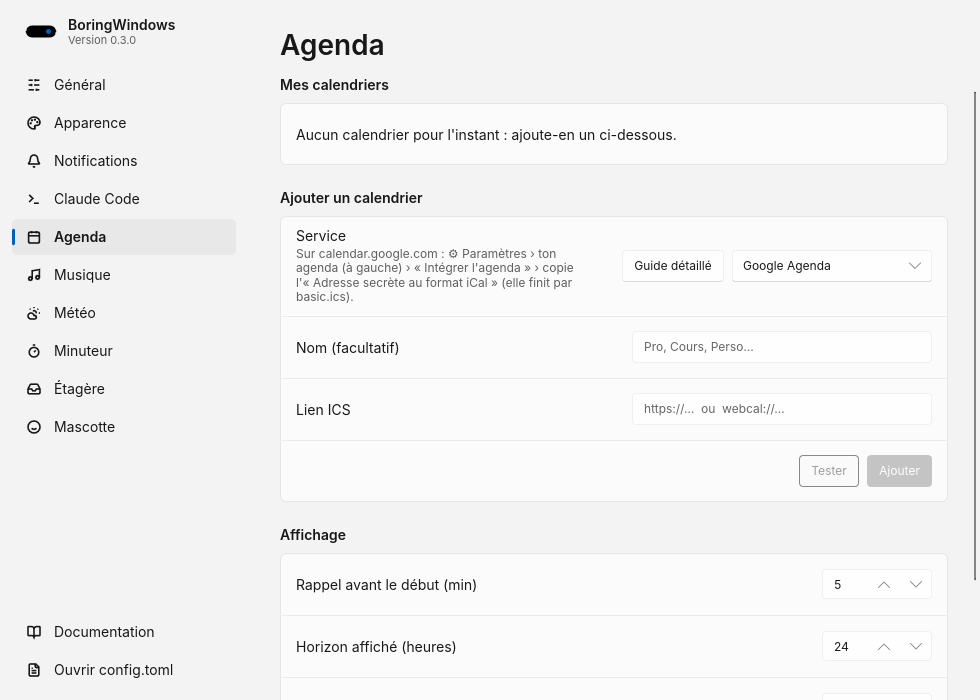

# Calendar

The island shows your **next classes or meetings**, reminds you **a few
minutes before** and offers a **Join** button when the invitation contains a
Teams, Google Meet, Zoom, Webex or Whereby link.


## The idea: an ICS link

Almost every calendar can publish an **ICS link** (also called "iCal" or
"secret address"): an address that always returns your up-to-date calendar.
BoringWindows reads it again every 10 minutes. No account to connect, no
password to hand over.

Pick your service to find that link:

- [Google Calendar](google.md)
- [Outlook and Microsoft 365](outlook.md)
- [iCloud](icloud.md)
- [Proton Calendar](proton.md)
- [CalDAV: iCloud, Fastmail, Nextcloud…](caldav.md)
- [Others: school timetable, any ICS link, .ics file](autres.md)

## Adding the link

### With the settings window (easiest)

1. Right-click the BoringWindows icon › **Settings…** › **Calendar**.
2. Pick your **service**: the window reminds you where to find the link, and
   **Step-by-step guide** opens the matching page of this guide.
3. Paste the **ICS link** — or **Browse…** to pick an `.ics` file — optionally
   give it a name, then **Test**: the window
   downloads the calendar and shows how many events it found and the next one.
4. **Add**. The calendar shows up in the island within a few seconds.



To remove a calendar: the **Remove** button next to its name.

### By hand, in config.toml

1. Right-click the BoringWindows icon › **Open configuration file**.
2. Paste at **the end of the file** one block per calendar:

   ```toml
   [[modules.calendar.sources]]
   name = "Work"
   url = "paste the ICS link here"
   ```

   `name` is free text, used in messages. For several calendars, repeat the
   whole block:

   ```toml
   [[modules.calendar.sources]]
   name = "Work"
   url = "https://outlook.office365.com/owa/calendar/…/calendar.ics"

   [[modules.calendar.sources]]
   name = "Personal"
   url = "https://calendar.google.com/calendar/ical/…/basic.ics"
   ```

3. **Save.** The calendar shows up in the island within a few seconds.

> ⚠️ **This link gives access to your calendar.** Don't share your
> `config.toml`, and if a link leaks, regenerate it from your service (each
> page explains how).

## What you see

| When | Pill |
|---|---|
| within the hour before | `At 14:30 · R52 · Team meeting` |
| 5 minutes before (configurable) | `In 4 min · R52 · Team meeting` |
| during the first 10 minutes | `Started · R52 · Team meeting` |

In the open island: events of the next 24 hours, with the time, the room, a
countdown within the coming hour and the **Join** button.

Handled: recurring meetings, deleted, moved or cancelled occurrences, all-day
events, time zones (including Outlook's). If the network drops, the last
downloaded version stays on screen.

## Settings

In **Settings… › Calendar › Display**, or in `config.toml`:

```toml
[modules.calendar]
remind_minutes = 5      # reminder before the start
refresh_minutes = 10    # update frequency
lookahead_hours = 24    # 48 to also see the day after tomorrow
show_all_day = true     # show all-day events
```

Details in the [reference](../configuration.md#modulescalendar).
