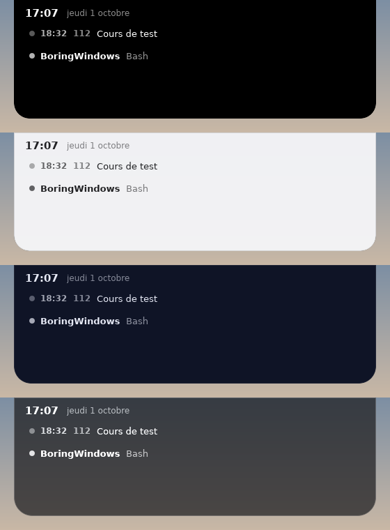

# Themes

A theme sets the island's colors, border, font and corner rounding in one go.
Four are built in:

| Name | Look |
|---|---|
| `default` | black, orange accent (the classic island) |
| `light` | light, blue accent, thin border: for light backgrounds |
| `midnight` | midnight blue, lavender accent |
| `glass` | smoked glass: slightly see-through, light border |



## Picking a theme

**Settings… › Appearance › Theme.** The island changes right away. Picking a
theme replaces the colors you had customized with the theme's.

Or in `config.toml`:

```toml
[theme]
name = "midnight"
```

## Tweaking a theme

Keys written in `[theme]` take **precedence** over the theme's. To keep
"midnight" with a green accent:

```toml
[theme]
name = "midnight"
accent = "#30D158"
```

Island sizes, animation duration and the offset from the top of the screen are
not part of themes: they are always set in `[theme]` (see the
[reference](configuration.md#theme)).

## Making your own theme

1. **Settings… › Appearance › Themes folder** (the `themes` folder next to
   `config.toml` is created if needed).
2. Create a text file `my-theme.toml` (the file name is the theme name):

   ```toml
   background = "#2B1B3DF0"   # background, slightly transparent
   foreground = "#F5EFFF"     # text
   accent = "#FF7AC6"         # urgent, buttons, upcoming meeting
   border = "#FFFFFF26"       # border (transparent: none)
   font = "Segoe UI Variable" # a font installed on Windows (empty: system font)
   corner_radius = 24.0       # corners of the open island
   ```

   Every key is optional: what's missing comes from the `default` theme.
3. It shows up in the theme list (reopen the settings window), or put
   `name = "my-theme"` in `[theme]`.

The file is watched: save it and the island updates. A mistake (unknown key,
badly written color) is shown in the island, as for `config.toml`.

Colors are written `"#RRGGBB"` or `"#RRGGBBAA"` (the last two digits: opacity,
from `00` transparent to `FF` opaque). Secondary text, buttons and bars are
derived from `foreground` and `accent`.

To share a theme, just send its `.toml` file.
