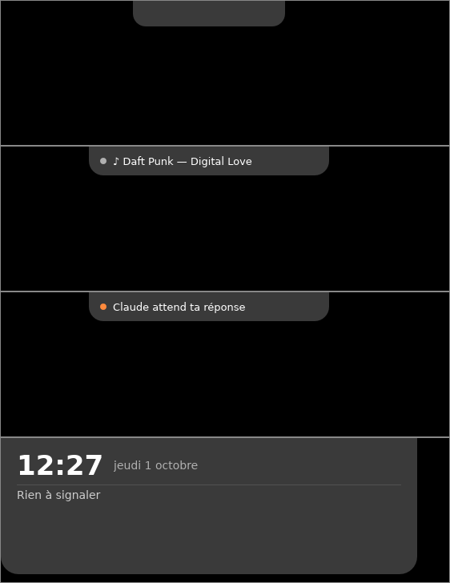

# Using the island

## The three states

| State | When | What you see |
|---|---|---|
| **Compact** | nothing to report | a small black pill |
| **Attention** | a module has something to say | a wider pill with a dot and a short text |
| **Open** | mouse over the island (or click) | the time, music, calendar, Claude sessions |

The pill's dot is **orange** when it's urgent (Claude is waiting for an
answer), grey otherwise. When music has the floor, the artwork replaces the
dot.

When several things happen at once, the most important one wins: a question
from Claude comes before a meeting that is starting, which comes before music.
The order between items of equal importance is set with
[`layout.compact`](configuration.md#layout).

## Tabs

The open island has tabs, top right:

- **Home**: music, calendar, Claude sessions, timer, shelf;
- **Notifs**: the latest app [notifications](notifications.md), with a badge
  for the ones you haven't seen;
- **Claude**: usage and
  [recent conversations](claude-code.md#recent-conversations-and-usage).

A tab only shows when its module is on. The island goes back to Home when it
closes.

## Open and close

- **Hover** the island to open it; it closes when the mouse leaves.
- Prefer clicking? Set `open_on = "click"` in
  [`[general]`](configuration.md#general).
- Only the pill reacts to the mouse: the rest of the strip at the top of the
  screen lets clicks through to the windows below.
- The island never takes focus: your keyboard stays in the app you're typing
  in.

## The tray menu

Right-click the BoringWindows icon in the notification area:

| Entry | Effect |
|---|---|
| Settings… | opens the settings window (see below) |
| Open configuration file | opens `config.toml` in your editor |
| Reload configuration | re-reads the file (only needed if automatic reload failed) |
| Claude Code: install / remove hooks… | connects Claude Code (see [Claude Code](claude-code.md)) |
| Start with Windows | starts BoringWindows with Windows |
| Hide the island | hides the island without quitting |
| Quit | quits BoringWindows |

## Full screen

When an application goes full screen (game, F11 video, presentation) on the
same screen, the island hides, then comes back when full screen ends. Turn this
off with `hide_in_fullscreen = false`.

Screenshot tools (Win+Shift+S, Snipping Tool, ShareX, Greenshot…) cover the
whole screen too, but the island stays visible while you capture.

The island stays above the taskbar, even when the taskbar sits at the top of
the screen.

## Changing the configuration

The easiest way: right-click the icon › **Settings…**. A tabbed window
(General, Appearance, Calendar, Claude Code, Music) edits the common settings; **every change is
saved and applied immediately**, there is no "OK" button. That's also where you
add a calendar (per-service assistant, **Test** button), install the Claude
Code hooks and run the diagnostic. The window can also open at startup:
`boringwindows.exe --settings`.

The app's language (English or French) follows the one of Windows; change it
in **Settings… › General › Language**, no restart needed.

The window writes to `config.toml` and keeps your comments and the order of
the file. For everything else (island sizes, module order…), edit the file
directly.

Everything is set in `%APPDATA%\BoringWindows\config.toml`. **Save the file: the
island updates immediately**, no restart needed. If the file contains an error,
the island shows it ("⚠ invalid config.toml…") and keeps the previous
settings.

Every option is described in the [reference](configuration.md).
