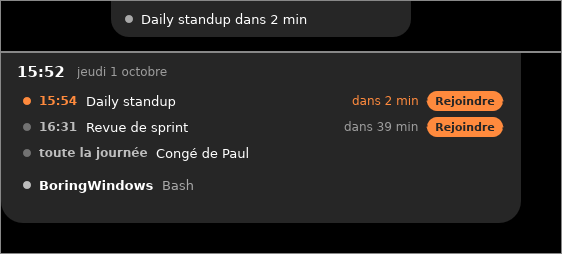

# Agenda

L'île affiche tes **prochains cours ou réunions**, te prévient **quelques
minutes avant** et propose un bouton **Rejoindre** quand l'invitation contient
un lien Teams, Google Meet, Zoom, Webex ou Whereby.



## Le principe : un lien ICS

Presque tous les agendas savent publier un **lien ICS** (aussi appelé « iCal »
ou « adresse secrète ») : une adresse qui donne ton agenda à jour, à tout
moment. BoringWindows le relit toutes les 10 minutes. Pas de compte à
connecter, pas de mot de passe à donner.

Choisis ton service pour savoir où trouver ce lien :

- [Google Agenda](google.md)
- [Outlook et Microsoft 365](outlook.md)
- [iCloud](icloud.md)
- [Proton Calendar](proton.md)
- [Autres : emploi du temps, lien ICS quelconque, fichier .ics](autres.md)

## Ajouter le lien

1. Clic droit sur l'icône BoringWindows › **Ouvrir la configuration**.
2. Colle à **la fin du fichier** un bloc par calendrier :

   ```toml
   [[modules.calendar.sources]]
   name = "Pro"
   url = "colle ici le lien ICS"
   ```

   Le `name` est libre, il sert dans les messages. Pour plusieurs calendriers,
   répète le bloc entier :

   ```toml
   [[modules.calendar.sources]]
   name = "Pro"
   url = "https://outlook.office365.com/owa/calendar/…/calendar.ics"

   [[modules.calendar.sources]]
   name = "Perso"
   url = "https://calendar.google.com/calendar/ical/…/basic.ics"
   ```

3. **Enregistre.** L'agenda apparaît dans l'île en quelques secondes.

> ⚠️ **Ce lien donne accès à ton agenda.** Ne partage pas ton `config.toml`, et
> si un lien fuite, régénère-le depuis ton service (chaque page explique
> comment).

## Ce que tu vois

| Moment | Pilule |
|---|---|
| dans l'heure qui précède | `À 14:30 · R52 · Réunion d'équipe` |
| 5 minutes avant (réglable) | `Dans 4 min · R52 · Réunion d'équipe` |
| pendant les 10 premières minutes | `Commencé · R52 · Réunion d'équipe` |

Dans l'île ouverte : les événements des prochaines 24 heures, avec l'heure, la
salle, un compte à rebours dans l'heure qui vient et le bouton **Rejoindre**.

Sont pris en compte : réunions récurrentes, occurrences supprimées, déplacées
ou annulées, événements sur la journée entière, fuseaux horaires (y compris
ceux d'Outlook). Si le réseau coupe, la dernière version téléchargée reste
affichée.

## Réglages

```toml
[modules.calendar]
remind_minutes = 5      # rappel avant le début
refresh_minutes = 10    # fréquence de mise à jour
lookahead_hours = 24    # 48 pour voir aussi après-demain
show_all_day = true     # afficher les événements « toute la journée »
```

Détails dans la [référence](../configuration.md#modulescalendar).
