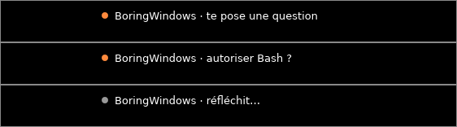

# Claude Code

L'île suit tes sessions [Claude Code](https://claude.com/claude-code) : elle
montre ce que fait Claude, te prévient quand il t'attend, et te laisse
**autoriser ou refuser une commande sans revenir au terminal**.



## Brancher Claude Code

1. Lance BoringWindows.
2. Clic droit sur son icône › **Claude Code : installer les hooks…**
3. La fenêtre qui s'ouvre liste exactement ce qui sera ajouté à
   `~/.claude/settings.json`. Réponds **Oui**.
4. **Relance tes sessions Claude Code** : elles ne lisent leurs hooks qu'au
   démarrage.

Ce qui se passe :

- une **sauvegarde datée** de `settings.json` est faite avant toute
  modification ;
- seules les entrées de BoringWindows sont ajoutées : tes autres réglages et
  tes propres hooks ne bougent pas ;
- le relais est copié dans `%LOCALAPPDATA%\BoringWindows\bin\bw-hook.exe` ;
  il est remis à jour automatiquement quand BoringWindows est mis à jour ;
- le même menu (« retirer les hooks… ») enlève tout proprement.

## Ce que montre l'île

| Pilule | Signification |
|---|---|
| ● gris · `projet · Bash` | Claude travaille (outil en cours) |
| ● gris · `projet · réfléchit…` | Claude rédige sa réponse |
| ● orange · `projet · autoriser Bash ?` | **demande de permission**, à traiter dans l'île |
| ● orange · `projet · te pose une question` | question ou plan à valider : **réponds dans le terminal** |
| ● orange · `projet · attend ta réponse` | Claude a fini et attend ton prochain message |
| `projet · terminé` | fin de tour (quelques secondes) |

Avec plusieurs sessions, la plus urgente occupe la pilule (`(+2)` indique les
autres) et l'île ouverte les liste toutes. **Clique sur une session** pour
ramener son terminal (Windows Terminal, VS Code…) au premier plan.

Un **son système** retentit chaque fois que Claude se met à t'attendre.

## Répondre à une demande de permission

Quand Claude veut lancer une commande qui demande ton accord, survole l'île :
elle affiche l'outil et la commande, avec trois boutons.

- **Autoriser** : Claude exécute la commande.
- **Refuser** : Claude ne l'exécute pas et continue autrement.
- **Terminal** : la question repasse dans le terminal, qui revient au premier
  plan (pour choisir « toujours autoriser », par exemple).

Sans réponse au bout de 60 secondes, la question repasse aussi dans le
terminal. Si tu réponds directement dans le terminal, la demande disparaît de
l'île.

Les **questions** de Claude (choix multiples, validation d'un plan) ne passent
pas par ces boutons : elles s'affichent normalement dans le terminal, l'île te
signale juste « te pose une question ».

## Réglages

Dans [`[modules.claude]`](configuration.md#modulesclaude) :

```toml
[modules.claude]
permissions = true          # répondre aux permissions depuis l'île
permission_wait_secs = 60   # délai avant de rendre la main au terminal
sound = true                # son quand Claude t'attend
```

## Si rien ne s'affiche

Lance le diagnostic, BoringWindows ouvert, dans un autre terminal :

```powershell
boringwindows.exe doctor
```

Il vérifie toute la chaîne et dit où elle casse. Détails dans
[Dépannage](depannage.md#claude-code--rien-ne-saffiche).

## Confidentialité

Le relais n'envoie à l'île qu'un **résumé** : nom du projet, outil, commande ou
nom de fichier. Jamais le contenu de tes fichiers ni tes messages à Claude. Le
canal (un *named pipe*) est local et réservé à ton compte Windows. Si
BoringWindows est fermé ou ne répond pas en 300 ms, le relais s'efface sans
rien faire : **Claude n'est jamais bloqué**.
