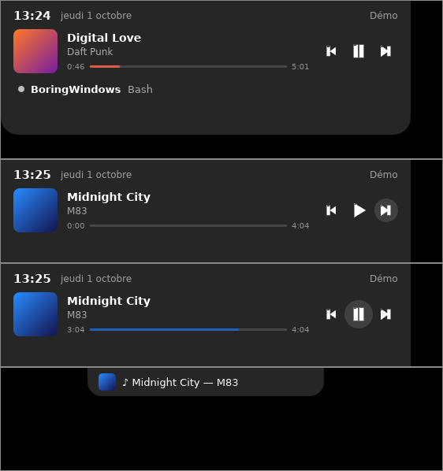

# BoringWindows

**Une « Dynamic Island » pour Windows**, en haut de l'écran : discrète quand il
ne se passe rien, elle s'anime quand quelque chose mérite ton attention et
s'ouvre au survol de la souris.

Ce qu'elle affiche :

- 🤖 **[Claude Code](claude-code.md)** : tes sessions en direct (travaille, te
  pose une question, a terminé) et les demandes de permission, auxquelles tu
  réponds sans quitter ce que tu fais.
- 🎵 **[Musique](musique.md)** : le morceau en cours (Spotify, Apple Music,
  navigateur, VLC…), pochette, précédent / pause / suivant. Rien à configurer.
- 📅 **[Agenda](agenda/index.md)** : tes prochains cours ou réunions (Google,
  Outlook, iCloud, emplois du temps…), un rappel avant le début et un bouton
  **Rejoindre** pour Teams, Meet ou Zoom.

Elle est légère (écrite en Rust, aucun navigateur embarqué), ne vole jamais le
focus et se cache toute seule quand tu passes une vidéo ou un jeu en plein
écran.

👉 Commence par l'[installation](installation.md).
